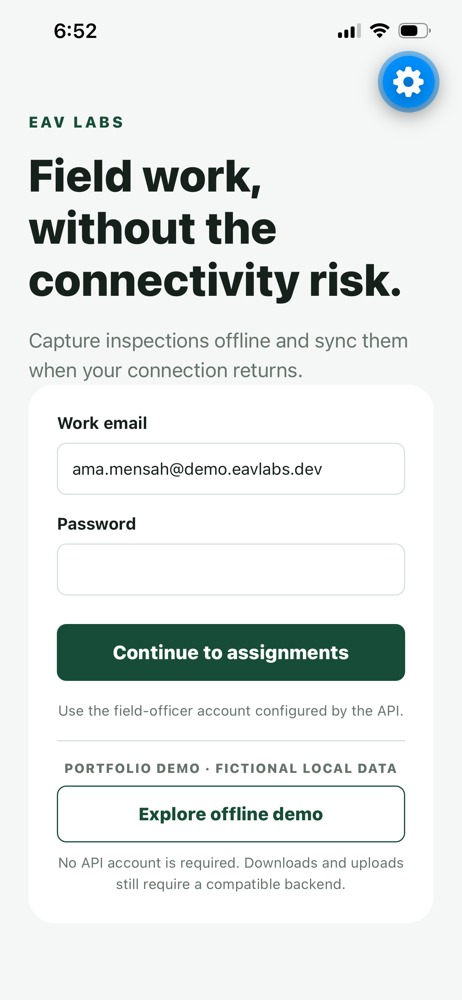
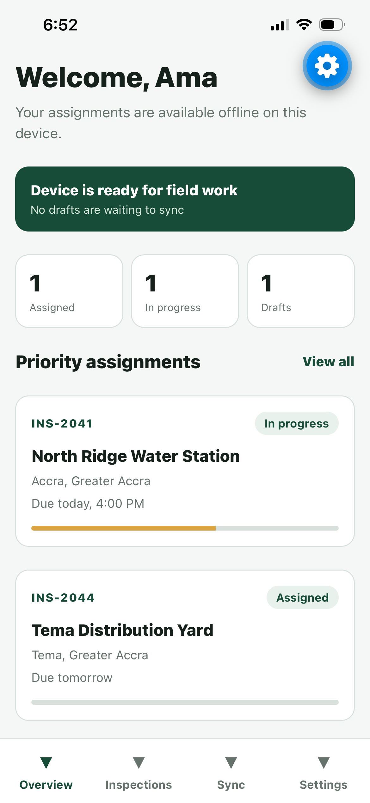
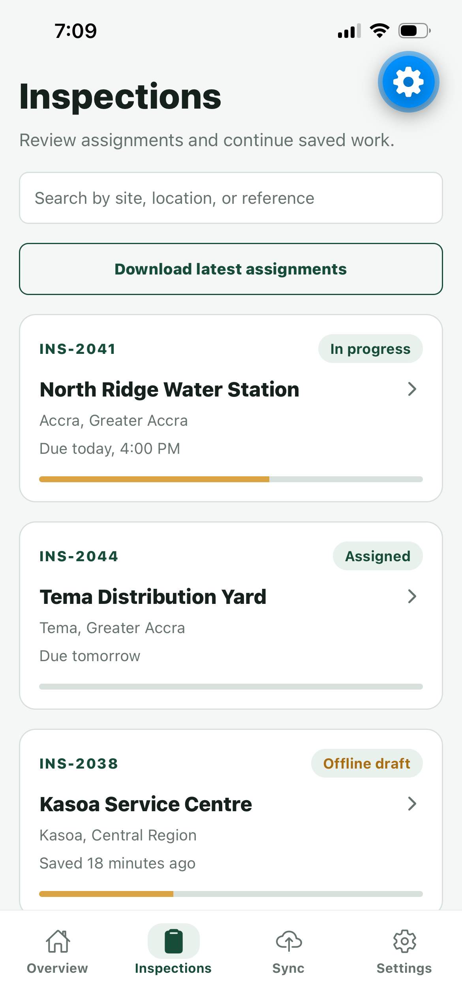
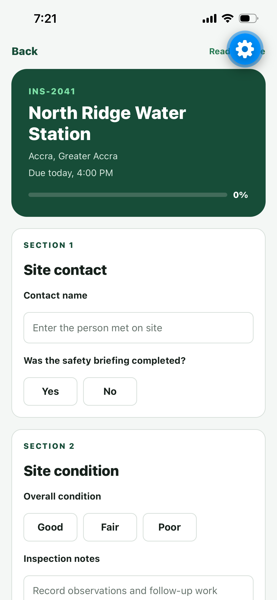
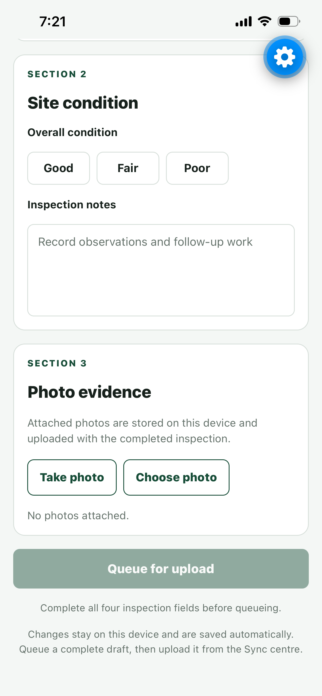
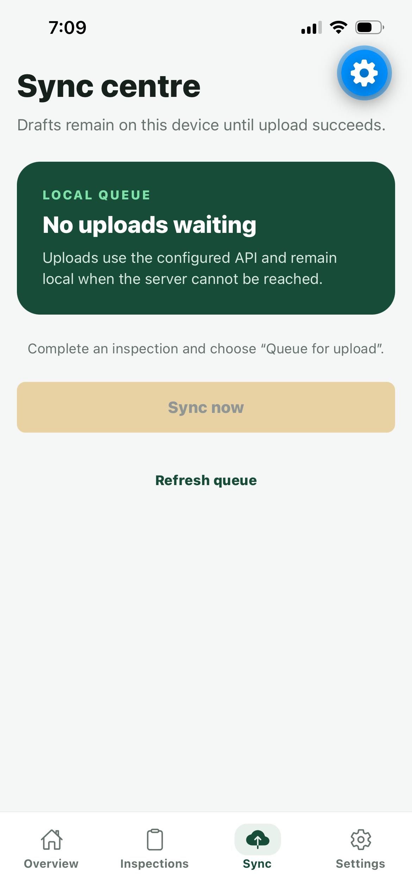
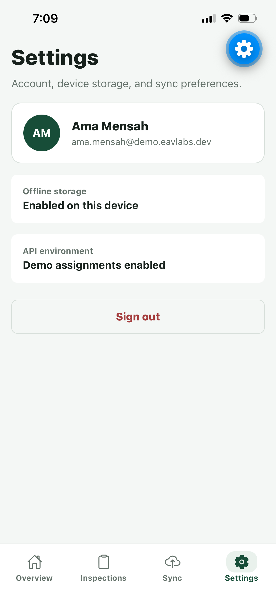

# EAV Field Mobile

Expo React Native application for field inspections, offline reporting, and reliable backend sync.

## Project status

Stage 1 of the EAV Field MVP is complete. The repository demonstrates secure API-backed session boundaries, an explicit offline portfolio demo, cached assignments, offline inspection drafts, durable photo evidence, a manual upload queue, and automated verification.

## Problem

Field teams often work where connectivity is unreliable. Inspection records must remain usable without a network connection, save safely on the device, and synchronize without losing work when connectivity returns.

## Current features

- Expo Router navigation
- API-backed field-officer sign-in and restored native sessions
- Explicit opt-in offline demo session for reviewers without a compatible Field API
- SecureStore token persistence, protected routes, and authenticated API headers
- Assignment dashboard and workload summary
- Searchable inspection list
- Authenticated assignment downloads with an atomic SQLite offline cache
- Offline-draft and synchronization status interface
- Versioned SQLite schema and bound-parameter draft repository
- Inspection detail route with a multi-section offline form
- Debounced draft autosave, recovery, and completion progress
- Camera and photo-library attachments copied into durable device storage
- Explicit upload queue with guarded transitions, failure metadata, and manual retry
- Startup recovery for uploads interrupted while in progress
- Centralized API client with authenticated JSON and multipart photo uploads
- Profile and device settings summary
- Shared TypeScript domain models and design tokens
- Unit test for inspection summaries
- GitHub Actions type-check and test workflow
- Validated Expo configuration and EAS preview/production build profiles

## Stage 1 evidence

- The offline demo workflow has been verified and captured on a physical iPhone.
- The screenshots below contain fictional portfolio data.
- Android visual verification and live Field API integration remain outside the Stage 1 demo claim.

## Stack

- Expo SDK 57
- React Native 0.86
- TypeScript
- Expo Router
- Expo SQLite
- Expo ImagePicker
- Expo FileSystem
- Expo SecureStore
- TanStack Query
- Zustand
- Jest with `jest-expo`
- GitHub Actions

## Local setup

### Requirements

- Node.js 20.19.4 or newer
- npm
- Expo Go or an Android/iOS simulator compatible with Expo SDK 57

### Install and start

```bash
git clone https://github.com/eav-labs-dev/eav-field-mobile.git
cd eav-field-mobile
git checkout dev
npm ci
cp .env.example .env
npm start
```

Use the Expo terminal options to open Android, iOS, or web.

## Checks

```bash
npm run typecheck
npm run test
npm run check
npm run config:check
npm run docs:check
```

## Environment

| Variable | Purpose | Default |
|---|---|---|
| `EXPO_PUBLIC_API_URL` | Backend base URL used for authentication, assignments, and synchronization | `http://localhost:8000` |
| `EXPO_PUBLIC_API_TIMEOUT_MS` | Maximum API request duration in milliseconds | `15000` |
| `EXPO_PUBLIC_DEMO_MODE` | Enables fictional portfolio assignments only when explicitly `true` | `false` |

Do not place secrets in `EXPO_PUBLIC_*` variables. Expo exposes those values to the application bundle.

Set `EXPO_PUBLIC_DEMO_MODE=true` only for a labelled portfolio demonstration. It exposes an “Explore offline demo” action backed by a fictional local session and assignments. When demo mode is false, that action is absent and dashboard, detail, and sync screens use authenticated API data cached on the device. Demo downloads and uploads are expected to fail unless a compatible Field API is configured.

## Screenshots and demo

These are unedited iOS captures of the opt-in offline demo. See the [reviewer walkthrough](docs/demo.md) for the reproducible flow.

| Login and explicit demo entry | Dashboard | Assignments |
|---|---|---|
|  |  |  |

| Offline inspection form | Photo evidence | Sync centre | Settings |
|---|---|---|---|
|  |  |  |  |

## Known limitations

- Synchronization is user-initiated; the MVP does not run a background connectivity worker.
- The API contract does not yet expose a conflict response and the client does not attempt automatic conflict resolution.
- Remote EAS builds require a maintainer to link the intended Expo project and provide signing credentials.
- Store submission, production usage, and physical-device verification against a live Field API are not claimed by this repository.
- Stage 1 visual evidence is iOS-only; Android uses the same Expo codebase but has not been visually certified here.

## Structure

```text
app/                         Expo Router screens and layouts
src/features/                Feature-scoped state, domain models, and UI
src/shared/components/       Reusable interface components
src/shared/theme/            Shared design tokens
docs/                        Architecture, roadmap, and project notes
```

## Documentation

- [Architecture](docs/architecture.md)
- [API synchronization contract](docs/api-sync.md)
- [Authentication contract](docs/authentication.md)
- [Release and demo builds](docs/release.md)
- [Reviewer demo walkthrough](docs/demo.md)
- [Roadmap](docs/roadmap.md)

## What this project demonstrates

EAV Field shows mobile product design, TypeScript application structure, field-operation workflows, offline-first planning, testable domain logic, and documentation discipline.

## License

See [LICENSE](LICENSE).
